# 资料  
vLLM操作手册.pdf   ---先看  
AI-Infra-Book.pdf   --- 后看  
vllm源码视频，----放后面看  

---
可以先看B站视频  
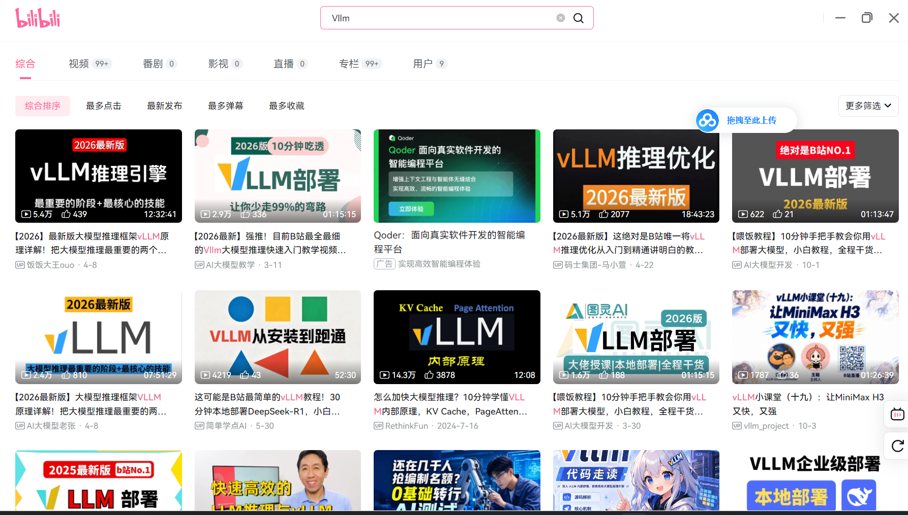

---
第四个视频：  
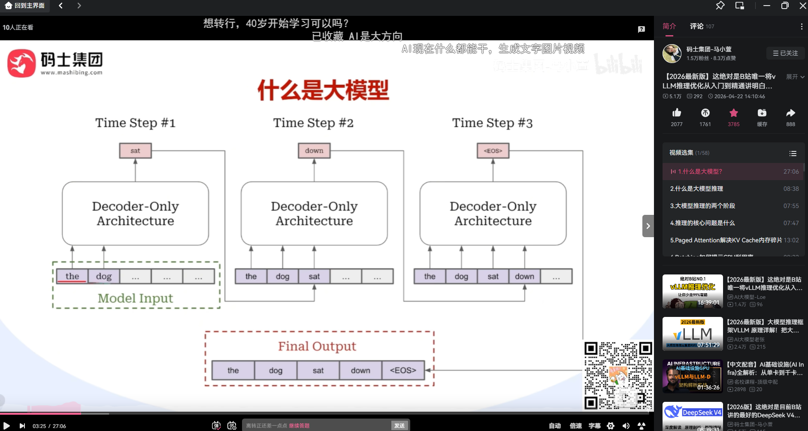  
大模型的本质：预测下一步的token是什么。

---

## KV Cahe  
KV Cache 是大模型推理中最核心的概念之一  
大模型生成文本是自回归的：每次只生成一个 Token，然后把新生成的 Token 拼接到输入后面，再生成下一个。这意味着，每生成一个新 Token，模型都要重新计算一遍所有历史 Token 的注意力。  
KV Cache 就是把这些重复计算的结果缓存下来，避免重复计算。  

- 工作原理：  
在 Transformer 的注意力机制中，每个 Token 会生成三个向量：Query（Q）、Key（K）、Value（V）。  
生成新 Token 时，只有当前 Token 的 Q 是新的。  
历史所有 Token 的 K 和 V 都不会变。  
所以，KV Cache 的做法是：  
第一次计算时，把所有 Token 的 K 和 V 存起来。  
后续每生成一个新 Token，只计算当前 Token 的 Q、K、V。  
用当前 Token 的 Q，去和缓存中所有历史 K 做注意力计算，再和缓存中所有历史 V 加权求和。  
把当前 Token 的新 K、V 追加到缓存中。  
效果：计算量从 O(n²) 降到 O(n)，推理速度大幅提升。  

传统 KV Cache 的三大痛点  
显存碎片化：每个请求的序列长度不同，KV Cache 大小也不同。如果提前按最大长度分配，浪费严重；如果动态分配，又会产生大量碎片。  
无法共享：多个请求如果有相同的 System Prompt（系统提示词），它们的 KV Cache 前缀完全一样，但传统方案会各存一份，浪费显存。  
扩容困难：序列长度是动态增长的，KV Cache 需要不断扩容，带来额外的内存拷贝开销。

vLLM 的解法：PagedAttention  
vLLM 的核心创新 PagedAttention，就是把操作系统的虚拟内存分页思想，搬到了显存管理上：  
把 KV Cache 切成固定大小的块（Block），比如每块存 16 个 Token。  
这些块在物理显存上可以不连续。  
用一张块表（Block Table）记录逻辑序列到物理块的映射。  
需要新块时，从显存池里分配；用完的块，归还给池子。  
这直接解决了碎片化问题，把显存利用率从约 30% 提升到 90% 以上。  

面试高频题：“KV Cache 为什么占显存？”、“PagedAttention 怎么管理 KV Cache？”、“多轮对话中 KV Cache 怎么复用？”

-----

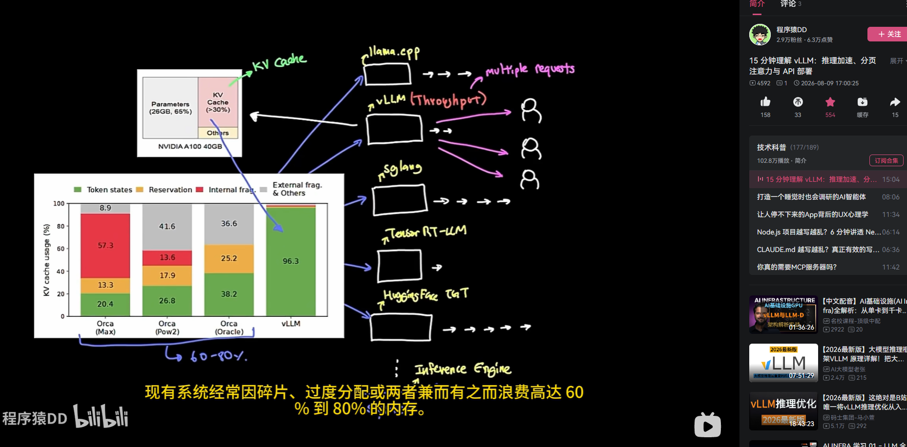  

传统系统，过度分配：  
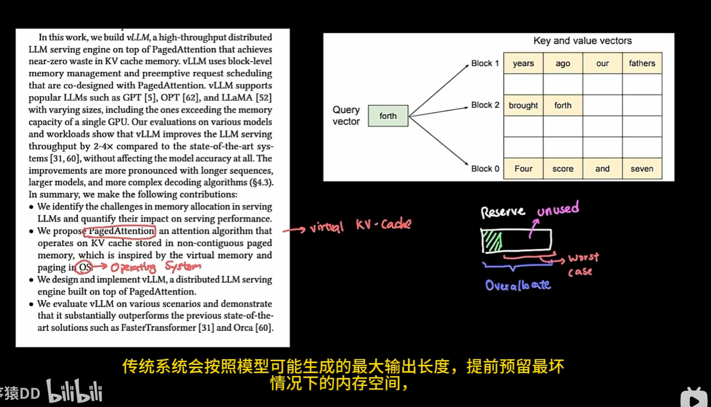  

vllm实现:  
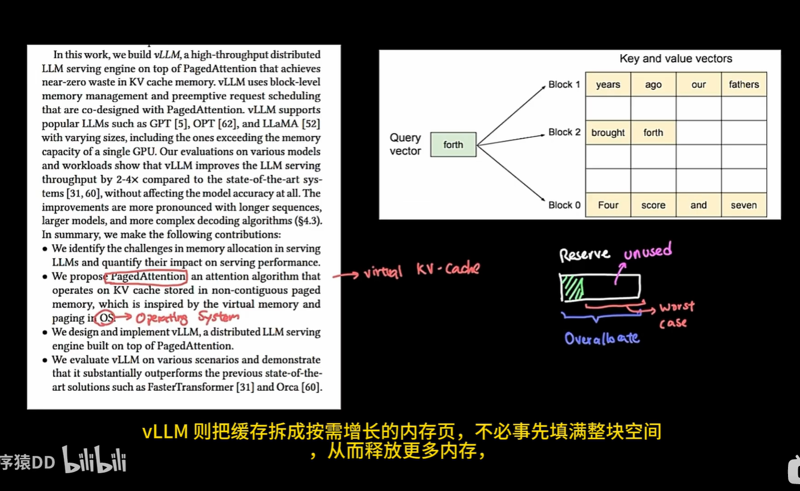  

不同推理框架侧重点不同：  
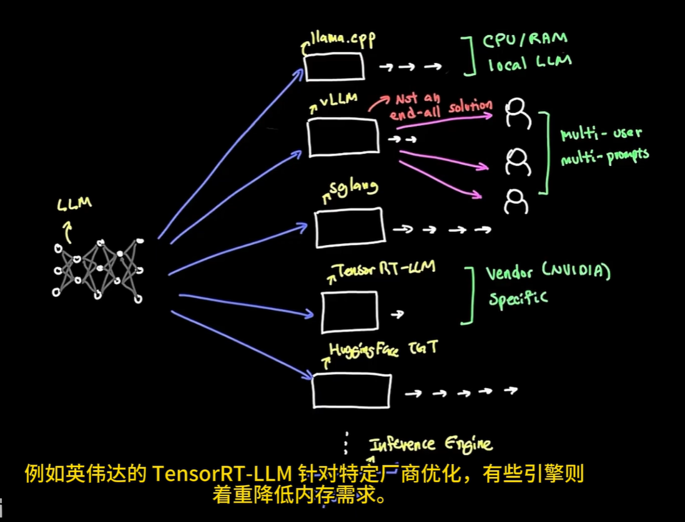  

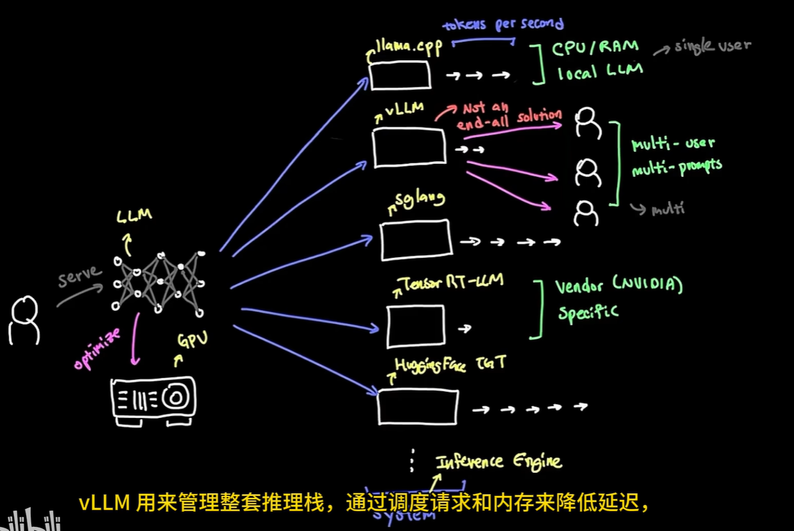  
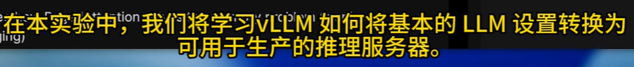  
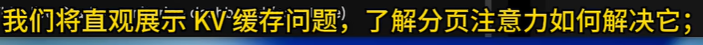  

---
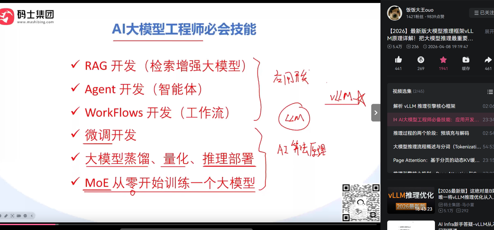  
  
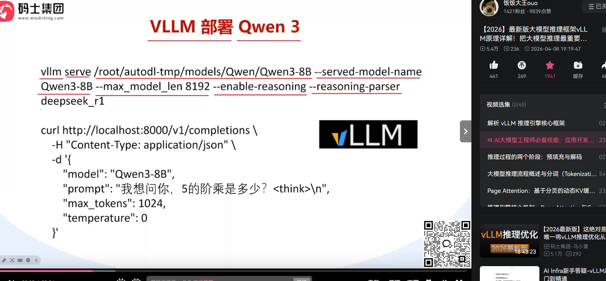  

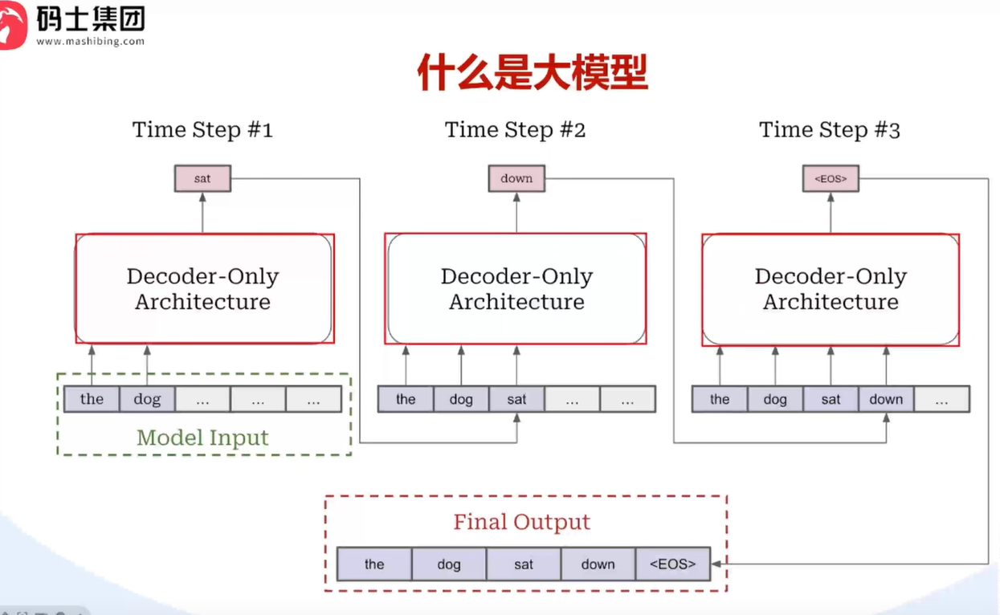  
decoder-only:  
Decoder-only（仅解码器）是当前几乎所有主流大语言模型（GPT、DeepSeek、Qwen、Llama）采用的架构。未来部署和优化的模型，几乎全是这个架构。  

- Transformer 最初在 2017 年论文《Attention Is All You Need》中提出时，是一个编码器-解码器（Encoder-Decoder）架构。后来演化出三种变体：  

| 架构 | 代表模型 | 核心特点 | 典型任务 |  
| :--- | :--- | :--- | :---|  
| Encoder-only |BERT | 双向注意力，能看完整句子 | 文本分类、情感分析 |  
|Encoder-Decoder	|T5、原始Transformer	|编码器理解输入，解码器生成输出	机器翻译、文本摘要|
Decoder-only	|GPT、DeepSeek、Qwen、Llama	|单向注意力，只能看左边的 Token	|文本生成、对话、代码生成  

---
- Decoder-only 的核心机制  
Decoder-only 的核心是自回归生成：  
输入一段文本（Prompt），模型预测下一个 Token。  
把预测出的 Token 拼接到输入后面，再预测下一个。  
循环往复，直到生成结束符或达到最大长度。  

- 关键特征：
单向注意力（Causal Attention）：每个 Token 只能看到它左边的所有 Token，看不到右边的（因为右边还没生成）。这是通过因果掩码（Causal Mask） 实现的。  
自回归：一步一步生成，每一步依赖前一步的输出。 
这正好解释了为什么需要 KV Cache：因为是逐步生成的，历史 Token 的 K、V 不会变，所以可以缓存起来，避免重复计算。Decoder-only 架构是 KV Cache 存在的根本原因。

- Decoder-only 的内部结构:  
一个标准的 Decoder-only 模型，由多个相同的 Transformer Block 堆叠而成，每个 Block 包含：  
多头自注意力（Multi-Head Self-Attention）：带因果掩码，只能看左边。  
前馈网络（Feed-Forward Network, FFN）：通常是一个两层 MLP，中间维度比模型维度大好几倍。  
残差连接 + 层归一化：保证训练稳定。  
Decode 阶段（推理时的核心）：每生成一个 Token，数据要穿过所有层，每层都要做注意力计算和 FFN 计算。这就是为什么推理延迟和层数、参数量直接相关。  

- 结合你的 AI Infra 方向:  
理解 Decoder-only，对你做推理优化至关重要：  
KV Cache 的来源：因为是 Decoder-only 的自回归生成，才有 KV Cache 的需求。你未来优化显存，核心就是优化 KV Cache。  
PagedAttention 的战场：vLLM 的 PagedAttention 管理的，就是 Decoder-only 模型中每层的 KV Cache。  
Prefill vs Decode：Decoder-only 推理分为两个阶段：Prefill（预填充） 处理整个 Prompt，计算密集；Decode（解码） 逐 Token 生成，访存密集。你未来要做的 PD 分离（Prefill-Decode Disaggregation），就是针对这两个阶段做不同的优化。  
Continuous Batching：因为 Decode 阶段每个请求进度不同，vLLM 用 Continuous Batching 动态调度，让 GPU 不闲着。  

---
大模型本质： predict next token。 每一时刻不断地输出下一时刻的词元（token）。  
期间即推理过程：inference