# markdown使用

- 小原点增加子项的办法，空格+空格- 代码上一个小原点下增加子原点。  
  - 像这样。

# 代码编译过程

.c .i .s .o .out

# 制作静态库
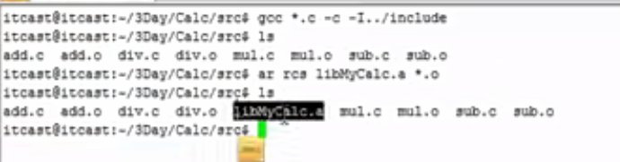
## 静态库要点

## 静态库的优缺点

# 动态库
## 虚拟地址空间
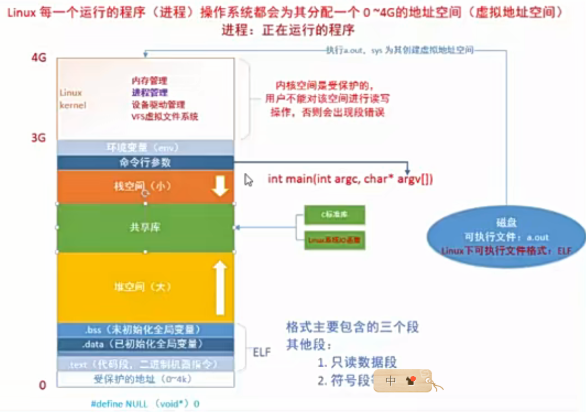
- 虚拟地址空间，来自硬盘。
- 静态库对比：.o文件放到代码段，每次放的时候都会放到固定的地址。程序运行时，第一次程序运行时怎么放，第二次运行进程时候还是怎么放。 这就是因为用到了绝对地址。就是所谓的静态库。
- 动态库，不会其提前加载到可执行程序中，在运行时候才加载。因为是动态加载，所以防止的共享位置也不一样。
- 动态库，生成于位置无关的程序。
- 查看可执行程序以来的动态库
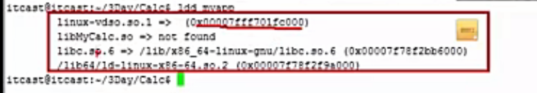
## 动态库整理
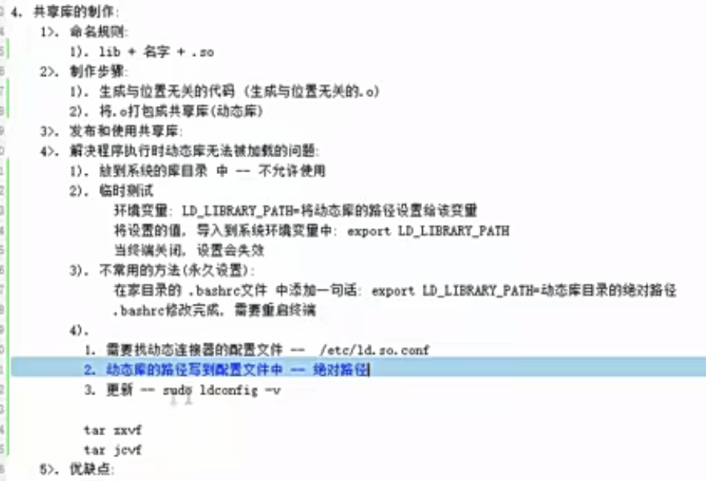
- 动态库的优缺点
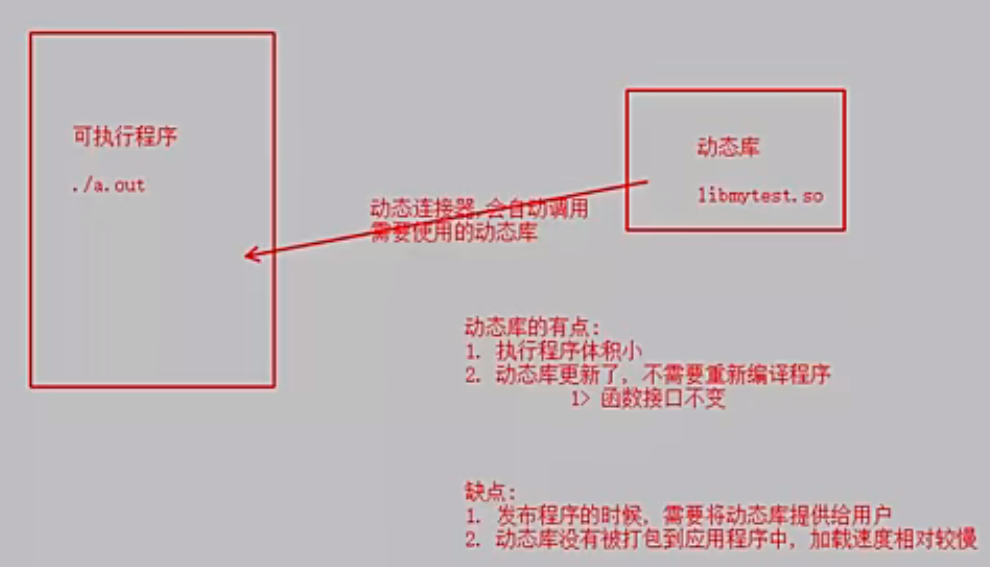

# gdb工具
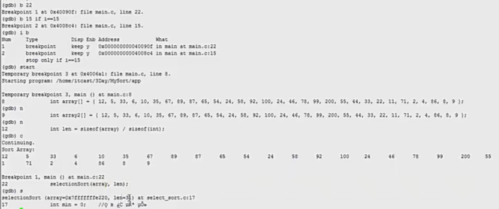
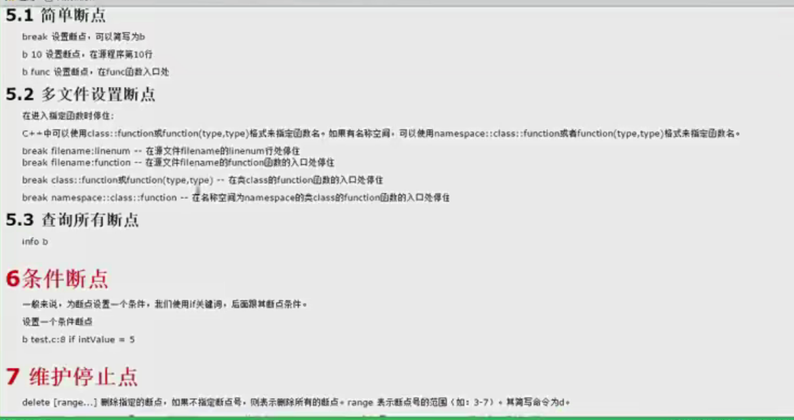

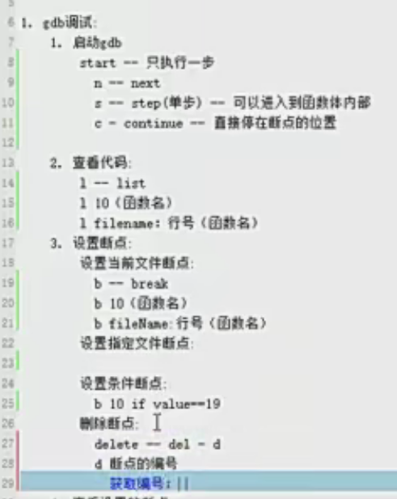

# makefile
- 三要素

- 第二版  
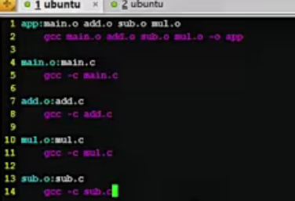

  - makefile 工作原理  
  
注意目标一定要放最前面。一旦最终目标生成了，后面就不会执行了。
  - 说明，是基于时间来判断是否要更新编译某个.o文件的。  
  比如，app生成时间肯定晚于add.o文件，如果检测到add.o文件比app晚，则说明add.o变过，则需要且只需要重新编add相关的。

  - makefile变量  
  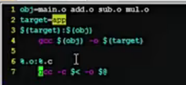  
  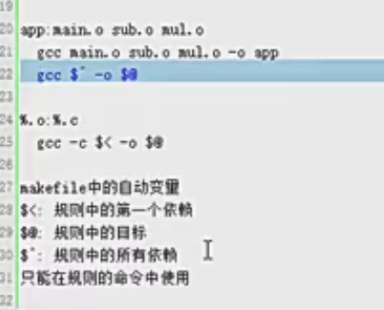  
  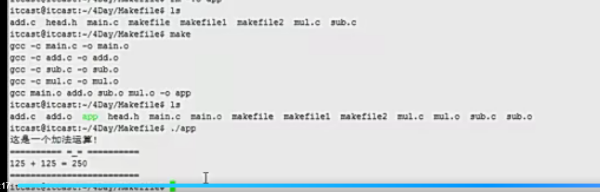

# 虚拟地址空间
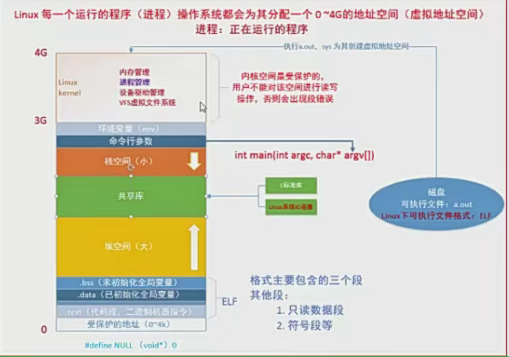
  - 32位操作系统，2的32次方，即4g， 0到4g的虚拟地址空间。 0到3g是用户区，3g到4g是Linux的内核区。文件描述符位置内核区，有个PCB的进程控制块:  
  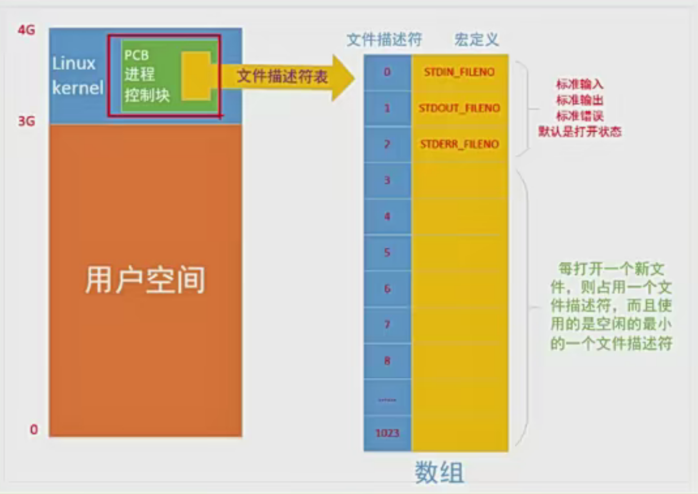  
  其实是一个数组，0到1023。  
  file命令，查看文件类型
  - 虚拟地址空间和磁盘空间映射  
  
  分配后，不是磁盘直接少4个G， 而是程序用多少，磁盘少多少。
