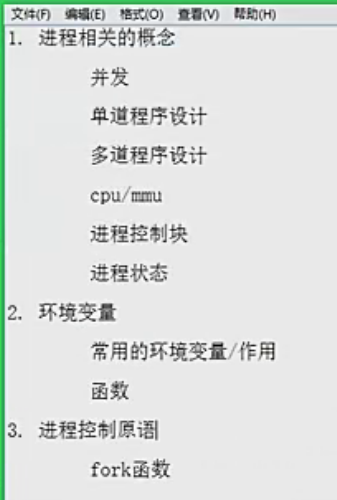
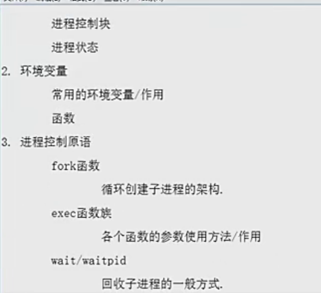
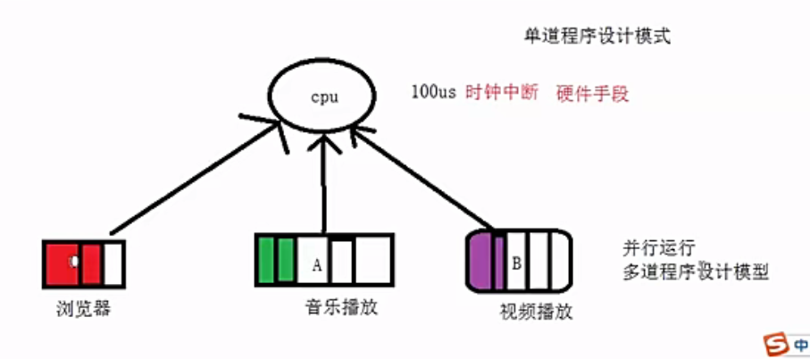

# markdown使用

- 小原点增加子项的办法，空格+空格- 代码上一个小原点下增加子原点。  
  - 像这样。

# 代码编译过程

.c .i .s .o .out

# 制作静态库

## 静态库要点

## 静态库的优缺点

# 动态库
## 虚拟地址空间

- 你截图中“受保护的地址（0~4K）”这个区域，在 Linux 系统中通常不存放任何用户数据，它是一个被刻意留空、禁止访问的内存区域。在 C/C++ 中，空指针的值就是 0（或者说 NULL）。如果程序不小心对空指针进行了读写，比如：
c
int *p = NULL;
*p = 100;   // 对空指针解引用，这是严重错误
编译器不会报错，但运行时程序会尝试访问地址 0。如果地址 0 所在的这块内存是可读写的，那么这个错误操作会悄无声息地成功，然后程序带着一个被破坏的、未知的状态继续运行，导致后面出现极难定位的随机崩溃或数据损坏。

为了避免这种情况，操作系统在加载程序时，会故意把地址 0 开始的 4KB 内存区域设置为“不可读、不可写、不可执行”。这样，一旦程序尝试访问空指针，CPU 会立刻触发一个段错误（Segmentation Fault），操作系统会直接终止这个进程，并告诉你“Segmentation fault (core dumped)”。

它的核心作用是防止空指针解引用。

- 在你截图的内存布局图中，共享库（Shared Libraries） 区域存放的是程序运行时需要调用的、由操作系统或第三方提供的公共代码和数据。

简单说，就是很多程序都要用的“公共工具”，在内存里只存一份，大家共享着用。

- 虚拟地址空间，来自硬盘。
- 静态库对比：.o文件放到代码段，每次放的时候都会放到固定的地址。程序运行时，第一次程序运行时怎么放，第二次运行进程时候还是怎么放。 这就是因为用到了绝对地址。就是所谓的静态库。
- 动态库，不会其提前加载到可执行程序中，在运行时候才加载。因为是动态加载，所以防止的共享位置也不一样。
- 动态库，生成于位置无关的程序。
- 查看可执行程序以来的动态库

## 动态库整理

- 动态库的优缺点

# gdb工具

# makefile
- 三要素

- 第二版  

  - makefile 工作原理  
  
注意目标一定要放最前面。一旦最终目标生成了，后面就不会执行了。
  - 说明，是基于时间来判断是否要更新编译某个.o文件的。  
  比如，app生成时间肯定晚于add.o文件，如果检测到add.o文件比app晚，则说明add.o变过，则需要且只需要重新编add相关的。

  - makefile变量  
    
    
  

# 虚拟地址空间

  - 32位操作系统，2的32次方，即4g， 0到4g的虚拟地址空间。 0到3g是用户区，3g到4g是Linux的内核区。文件描述符位置内核区，有个PCB的进程控制块:  
    
  其实是一个数组，0到1023。  
  file命令，查看文件类型
  - 虚拟地址空间和磁盘空间映射  
  
  分配后，不是磁盘直接少4个G， 而是程序用多少，磁盘少多少。

# Linux系统编程

 
 - 资料：01_Linux系统编程-进程.docx
 - 页是mmu完成内存映射的最小单位。页  4k

 - 页是操作系统管理内存的最小单位，4K 是最常见的页大小。 操作系统把虚拟内存和物理内存都切成 4KB 的页，通过页表建立映射关系，并给每一页设置权限，从而实现内存的分配、共享、保护和隔离。

- PCB，进程控制块，本质是一个结构体。

